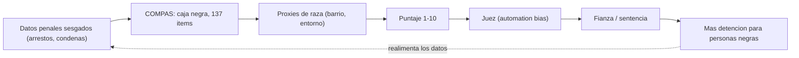

# Trabajo Práctico — "Juicio a los algoritmos"
## Caso 1: COMPAS — Dossier de la ACUSACIÓN

**Materia:** I.IA — Ing. VB · **Modalidad:** trabajo grupal · **Lado:** Acusación ("ataque")

> Documento integrador del grupo. Reúne de forma coherente las tres partes en que dividimos el trabajo —[el caso y los hechos](PARTE-1-CASO-Y-HECHOS.md), [el dilema ético-social](PARTE-2-DILEMA-ETICO.md) y [el funcionamiento técnico](PARTE-3-FUNCIONAMIENTO-TECNICO.md)— y las ordena como un único alegato. Toda afirmación está respaldada por las fuentes verificadas de la carpeta [`fuentes/`](fuentes/), referenciadas como `[F0x]` (índice completo en [RESUMEN.md](RESUMEN.md)).

---

## 0. Nuestra postura en una frase

Un sistema secreto y apenas mejor que el azar informado influyó en decisiones sobre la **libertad** de miles de personas y dañó de forma desproporcionada a un grupo históricamente discriminado. Detrás de ese daño hubo **decisiones humanas concretas** —de la empresa, del Estado comprador, de los jueces y del regulador— y nuestro trabajo es rastrearlas y repartir la responsabilidad. La respuesta nunca es "lo decidió la IA".

---

## 1. Qué pasó (los hechos)

COMPAS es una herramienta actuarial creada por **Northpointe** (hoy **Equivant**) que puntúa el riesgo de reincidencia de personas acusadas en EE.UU. Ese puntaje (escala 1-10) influye en **fianza, libertad condicional y sentencia**. [F06]

- **2016 — ProPublica, "Machine Bias":** sobre +7.000 casos de Broward (Florida), el sistema marcaba erróneamente como "alto riesgo" a personas negras casi al doble que a las blancas (**≈45% vs ≈23%** de falsos positivos), e infravaloraba el riesgo de las blancas que sí reincidían. Controlando antecedentes, edad y género, las personas negras seguían siendo **77% más propensas** a ser marcadas de alto riesgo violento. [F01]
- **Respuesta de Northpointe:** negó el sesgo invocando la **calibración** (paridad predictiva). [F02]
- **State v. Loomis (Wisconsin, 2016):** Eric Loomis fue sentenciado a 6 años con un puntaje de alto riesgo; la Corte avaló el uso pero impuso advertencias y reconoció que la **fórmula es secreto comercial**, inaccesible para la persona y el tribunal. La Corte Suprema de EE.UU. no revisó el caso (2017). [F03]

Todo esto ocurre dentro de un sistema penal donde las personas negras están encarceladas a **~5 veces** la tasa de las blancas. [F09]

---

## 2. Cómo funciona la IA (y por qué eso importa)

COMPAS no es una IA sofisticada: es un **modelo estadístico actuarial**. Toma un cuestionario de **137 ítems** más antecedentes penales, compara a la persona con grupos de referencia y devuelve un riesgo de 1 a 10. La fórmula de ponderación es **secreta**. [F06]

Tres hechos técnicos sostienen la acusación:

1. **Sesgo por proxies:** aunque no usa "raza", variables como barrio, entorno y arrestos previos están correlacionadas con la raza y la reintroducen indirectamente. [F06][F01]
2. **Teorema de imposibilidad de la equidad:** con tasas base distintas entre grupos, ningún modelo imperfecto puede ser justo según todas las definiciones a la vez. ProPublica y Northpointe **podían tener razón simultáneamente**. La consecuencia: **alguien tuvo que elegir** qué equidad priorizar, y lo hizo la empresa en secreto. [F04]
3. **La complejidad no aporta valor:** COMPAS acierta ~65%, igual que personas sin formación y que un modelo de **2 variables**. Los 137 ítems y la opacidad no se justifican. [F05]

---

## 3. Por qué es un problema ético y social

El núcleo no es estadístico, es **moral**: decidir sobre la **libertad** de una persona con una probabilidad de **grupo**, una fórmula **secreta** y datos de un sistema que **ya discrimina**. [F10][F09]

- **Individuo vs. grupo:** se juzga a la persona por la conducta estadística de "gente parecida", no por sus actos. [F10][F03]
- **Objetividad aparente:** un número "neutral" construido sobre datos sesgados **lava** la discriminación y la vuelve difícil de impugnar. [F09]
- **Supervisión ilusoria:** el **sesgo de automatización** lleva al operador a deferir a la máquina; el "humano en el bucle" se convierte en una **"zona de absorción moral"** que protege a quien diseñó la caja negra. [F10]
- **Círculo que se autocumple:** puntaje alto → más detención → más antecedentes → datos que "confirman" el riesgo. [F09]

---

## 4. Tesis de la acusación y reparto de responsabilidad

El veredicto no es "ganó la acusación o la defensa": es un **reparto de responsabilidad**. Sostenemos:

| Actor | Decisión humana concreta | Peso sugerido |
|---|---|---|
| **Northpointe / Equivant** | Diseñó y vendió un modelo de alto impacto como caja negra; eligió el trade-off de equidad en secreto y sin auditoría. [F02][F04][F06] | **Principal** |
| **Estado / agencias compradoras** | Compró y desplegó el sistema sin exigir auditoría, transparencia ni pruebas de no discriminación. [F03][F07] | **Alto** |
| **Jueces / operadores** | Usaron el puntaje como dato objetivo, sin supervisión humana real. [F03][F10] | **Medio** |
| **Regulador / legislador** | Llegó tarde: ningún estándar de transparencia o control de sesgo. [F07][F08] | **Medio-bajo** |
| **Sistema penal "upstream"** | Datos de arrestos que reflejan disparidades preexistentes. [F01][F09] | **Atenuante de contexto, no excusa** |

Reparto orientativo a defender (ajustable en el juicio): **empresa ~45%, Estado/comprador ~25%, jueces ~20%, regulador ~10%**.

---

## 5. Anticipación de la defensa y nuestras réplicas

| Argumento de la defensa | Nuestra réplica |
|---|---|
| "Precisión global pareja entre razas." [F01] | El promedio oculta el **reparto desigual del error**; a la persona la afecta el falso positivo concreto, no la tasa global. [F01] |
| "Está calibrado, es justo." [F02] | Calibración es **una** de tres definiciones; elegirla —en secreto— sacrifica el balance de falsos positivos que daña a las personas negras. [F04] |
| "Es apoyo, no decisión; el juez es responsable." [F03] | En la práctica el **automation bias** ancla la decisión; *Loomis* impuso advertencias porque el puntaje pesa. Acusamos también al juez, pero la empresa no se esconde tras él. [F10][F03] |
| "El sesgo es matemáticamente inevitable." [F04] | Inevitable es el **trade-off**, no la **opacidad** ni la falta de auditoría. La responsabilidad es por cómo y quién eligió. [F04] |
| "El daño viene del sistema penal, no del software." [F09] | Reflejar una injusticia con apariencia de objetividad la **amplifica y legitima**; usar datos que se sabían sesgados sin control es negligencia. [F09] |
| "No había ley que obligara a auditar." [F07][F08] | La ausencia de ley no es ausencia de deber: el estándar es la **responsabilidad profesional**. El vacío reparte carga al regulador, no la borra. [F08] |

El punto donde "se gana o se pierde" (réplicas cruzadas): la tensión **calibración vs. balance de errores**. Ambos lados tienen razón técnica, así que el debate real es de **responsabilidad por las decisiones humanas**: quién eligió la métrica en secreto, quién compró sin auditar, quién usó sin supervisar y quién no reguló a tiempo. [F04][F03][F07]

---

## 6. Marco legal

- **Unión Europea — AI Act:** un sistema como COMPAS sería **ALTO RIESGO** (Anexo III, puntos 6 y 8) y debería cumplir gestión de riesgos, gobernanza de datos, transparencia, supervisión humana, registros y, en organismos públicos, una evaluación de impacto en derechos fundamentales (FRIA). Matiz: el AI Act es de 2024 y en mayo de 2026 se pospusieron las obligaciones de alto riesgo a diciembre de 2027. [F07]
- **Argentina — el vacío:** no hay ley específica de IA. Rige de costado la **Ley 25.326** (2000). Hay proyectos (transparencia algorítmica, derecho a no ser objeto de decisiones automatizadas, derecho a la explicación) pero ninguno es ley vigente. Sin ley específica, el estándar real es la **responsabilidad profesional**. [F08]

Usamos el AI Act como **vara de lo exigible**: no para aplicarlo retroactivamente, sino para mostrar qué habría hecho un profesional responsable aunque no fuera obligatorio.

---

## 7. Las siete preguntas del técnico aplicadas a COMPAS

1. **¿Con qué datos se entrenó y de dónde salieron?** Registros penales y cuestionarios de poblaciones de referencia de EE.UU., que arrastran las disparidades del sistema penal; su representatividad no es transparente. [F06][F09]
2. **¿A quién perjudica si se equivoca y qué tan grave es?** A personas acusadas —desproporcionadamente negras— en decisiones sobre su **libertad**. Gravísimo. [F01]
3. **¿Se puede explicar cómo decide o es caja negra?** **Caja negra:** fórmula propietaria, no auditable. [F06][F03]
4. **¿Hay supervisión humana con poder real de revertir?** Formalmente el juez; en la práctica, erosionada por el **automation bias**. [F10][F03]
5. **¿La persona sabe que hay una IA decidiendo y puede apelar?** Sabe que hay un puntaje, pero no puede impugnar su mecánica interna. [F03]
6. **¿Se probó si funciona peor con algún grupo?** Sí: errores asimétricos por raza (ProPublica); la empresa lo discute con otra métrica. Alguien debió elegir qué equidad priorizar. [F01][F02][F04]
7. **Si sale mal, ¿quién responde?** Hoy la responsabilidad está **difusa**; este juicio existe para repartirla. [F03][F07][F08]

---

## 8. Conclusión

COMPAS es un caso de manual de cómo una decisión humana se disfraza de decisión técnica. La empresa eligió, en secreto, qué definición de equidad sacrificar; el Estado compró sin auditar; los jueces confiaron en un número que no podían revisar; y el regulador llegó tarde. La precisión mediocre del sistema (~65%, igual que legos) y su opacidad no se justifican frente al poder que ejerce sobre la libertad de las personas. La acusación pide que el jurado reparta la responsabilidad entre esos actores —con la empresa al frente— y reafirme el principio del trabajo: **la tecnología no tiene consecuencias por sí sola; las consecuencias dependen de decisiones humanas.**

---

## Anexos y material de trabajo

- [PARTE-1-CASO-Y-HECHOS.md](PARTE-1-CASO-Y-HECHOS.md) — hechos, daño, actores (subgrupo 1).
- [PARTE-2-DILEMA-ETICO.md](PARTE-2-DILEMA-ETICO.md) — dilema moral y contexto social/cultural (subgrupo 2).
- [PARTE-3-FUNCIONAMIENTO-TECNICO.md](PARTE-3-FUNCIONAMIENTO-TECNICO.md) — funcionamiento técnico (subgrupo 3).
- [RESUMEN.md](RESUMEN.md) — síntesis general e índice de fuentes.
- [`fuentes/`](fuentes/) — fuentes verificadas (F01-F10).
